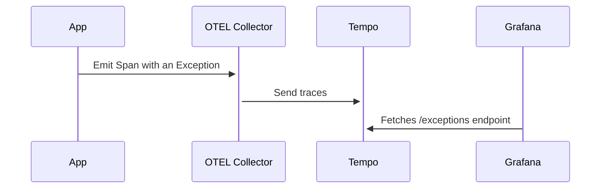

# Grafana Errors

Visualize application exceptions/errors in Grafana. This project uses Spans 
enriched with meta-data from the Exceptions (see [here](https://opentelemetry.io/docs/reference/specification/trace/semantic_conventions/exceptions/)).

## Diagram



## Components

### faulty

Django app with OpenTelemetry auto-instrumentation enabled. By default, the Django library for OTEL attaches exceptions
to spans when an error happens. Browse `localhost:8080` to get an error.

### OpenTelemetry Collector

Collects exported traces and send them to Tempo

### Tempo

You need to build locally (`make docker-component`) this [fork](https://github.com/marctc/tempo/tree/exceptions). It contains an endpoint which fetches and exposes 
spans that contain exceptions data.

```
curl 'localhost:3100/querier/api/exceptions?start=1660836710&end=1660837100'
```

### Grafana
TODO: Should display the exceptions as list, counting the number of times that happened for given a time range and
with the option to visualize individual occurrences (spans) of an specific exception. 
[This](https://github.com/grafana/sentry-datasource) could be a good starting point.